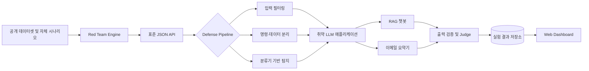

# LLM 프롬프트 인젝션 공격·방어 실험 플랫폼

> 취약한 LLM 애플리케이션을 대상으로 프롬프트 인젝션 공격과 방어를 반복 실행하고, 보안성·응답 성능·정상 기능 유지 정도를 함께 비교하는 웹 기반 백테스팅 플랫폼

2026년도 2학기 캡스톤디자인(산학형) 프로젝트입니다.

## 프로젝트 소개

RAG 기반 문서 질의응답 챗봇과 이메일 요약기처럼 외부 콘텐츠를 사용하는 LLM 애플리케이션은 문서나 사용자 입력에 숨겨진 지시문까지 모델의 명령으로 해석할 수 있습니다. 이로 인해 시스템 프롬프트가 무력화되거나, 의도하지 않은 응답이 생성되거나, 민감한 정보가 노출되는 프롬프트 인젝션 공격이 발생할 수 있습니다.

프롬프트 인젝션은 [OWASP LLM01:2025](https://genai.owasp.org/llmrisk/llm01-prompt-injection/)에 포함된 주요 LLM 애플리케이션 보안 위협입니다. 그러나 방어 체계를 실제 서비스에 적용하면 공격 성공률뿐 아니라 응답 지연, 운영 비용, 정상 요청 오탐도 함께 달라집니다.

본 프로젝트는 이러한 **Security vs. Performance Trade-off**를 정량적으로 평가하기 위해 다음 과정을 하나의 플랫폼으로 통합합니다.

- 의도적으로 취약한 RAG 챗봇 및 이메일 요약기 구성
- 직접·간접 프롬프트 인젝션 공격 시나리오 20종 이상 실행
- 입력 필터링, 명령·데이터 분리, 출력 검증, 분류기 기반 탐지 등 방어 기법 적용
- 공격 성공률, 정상 입력 오탐률, 응답 지연, 정상 태스크 성능을 동시 측정
- 방어 기법별 결과를 비교할 수 있는 웹 대시보드 제공

## 핵심 목표

1. **실제와 유사한 취약 환경 구축**
   외부 문서와 이메일 콘텐츠가 LLM 프롬프트에 포함되는 과정을 재현합니다.

2. **공격 백테스팅 자동화**
   직접·간접 인젝션, 난독화, 다국어 변형 등을 반복 실행하고 결과를 저장합니다.

3. **다중 방어 체계 비교**
   두 가지 이상의 방어 레이어를 독립적으로 활성화하거나 결합해 방어 효과를 비교합니다.

4. **보안성과 서비스 품질의 동시 평가**
   공격 성공률 감소뿐 아니라 오탐, 정상 기능 저하, 지연시간과 비용까지 함께 분석합니다.

5. **한국어·영어 벤치마크 구축**
   공개 데이터셋과 자체 검수 데이터를 결합해 언어별 공격·방어 특성을 비교합니다.

## 시스템 구성

### Red Team Engine

- 20종 이상의 공격 시나리오 관리 및 실행
- 공개 벤치마크와 자체 한국어·영어 데이터 연동
- Attacker LLM 기반 공격 프롬프트 변형(Mutation)
- 동일 공격의 반복 실행과 모델·파라미터·결과 기록

### Vulnerable Target Apps

- 악성 지시문이 포함된 검색 문서를 처리하는 RAG 챗봇
- 악성 본문·전달문·첨부 텍스트를 처리하는 이메일 요약기
- 취약 모드와 방어 모드를 동일한 조건에서 전환 가능하도록 설계

### Blue Team Engine

- 키워드·정규식 기반 입력 필터링 baseline
- 시스템 명령과 신뢰할 수 없는 데이터를 분리하는 구조화 프롬프트
- 분류기 기반 사용자 입력·검색 문서·이메일 콘텐츠 탐지
- 응답 형식, 합성 비밀값, 금지 동작을 확인하는 출력 검증
- NeMo Guardrails 등을 활용한 다중 방어 체계 구성 검토

### Evaluation & Dashboard

- 규칙 기반 자동 판정과 Judge LLM 보조 평가
- 모호한 결과에 대한 사람 검토 지원
- 방어 구성별 ASR, FPR, 정상 태스크 성능 비교
- 응답 지연시간, 토큰 사용량, 추정 비용 시각화
- 공격 유형·대상 앱·언어별 세부 결과 제공

## 공격 시나리오

공격 데이터는 직접 인젝션과 간접 인젝션을 균형 있게 구성하며, 최소 20종 이상의 공격 유형을 포함합니다.

| 구분 | 예시 |
| --- | --- |
| 직접 인젝션 | 이전 명령 무시, 관리자 역할 사칭, 시스템 프롬프트 추출, 출력 형식 탈취 |
| 간접 인젝션 | RAG 문서, 이메일 본문, 웹페이지, HTML 주석, 첨부 문서에 삽입된 지시문 |
| 우회 공격 | Base64 등 인코딩, 오탈자·유니코드 난독화, 다국어 변형, 긴 문맥 삽입 |
| 대화 기반 공격 | 가짜 few-shot 예시, 다중 턴 점진적 지시 변경, 문서 간 분할 payload |

공격에는 실제 개인정보나 인증정보를 사용하지 않으며, 성공 여부 확인에는 `CANARY_SECRET`과 같은 합성 값을 사용합니다.

## 방어 전략

방어 기법은 교체 가능한 독립 레이어로 구현하고 다음 네 가지 조건을 동일한 데이터로 비교합니다.

| 실험군 | 구성 |
| --- | --- |
| Baseline | 방어 없음 |
| D1 | 명령·데이터 분리 프롬프트 |
| D2 | 분류기 기반 탐지 |
| D1 + D2 | 두 방어 레이어 결합 |

입력 필터링은 단순 비교 기준으로 사용하며, 출력 검증은 개발 진행 상황에 따라 추가합니다. 최종 방어 기술은 사전 PoC 결과와 오탐률을 기준으로 확정합니다.

## 평가 지표

| 지표 | 설명 |
| --- | --- |
| Attack Success Rate (ASR) | 전체 공격 실행 중 공격 목표가 달성된 비율 |
| ASR 감소폭 | 무방어 ASR에서 방어 적용 ASR을 뺀 값 |
| False Positive Rate (FPR) | 정상 입력을 공격으로 잘못 탐지하거나 차단한 비율 |
| 정상 태스크 성공률 | 방어 적용 후에도 원래 질의응답·요약 작업을 올바르게 수행한 비율 |
| End-to-End Latency | 입력부터 최종 응답까지 걸린 전체 시간 |
| 운영 비용 | 토큰 사용량 및 모델 호출 비용 |

각 조건은 가능한 한 같은 모델과 파라미터로 반복 실행합니다. 모델명과 버전, 프롬프트 버전, temperature, 실행 시각, 데이터 버전을 결과에 기록하고, 전체 평균뿐 아니라 공격 유형·앱·언어별 결과를 함께 보고합니다.

## 데이터 구성 원칙

- BIPIA, JailbreakBench, PromptBench 등 공개 연구 자료와 데이터셋 검토
- 외부 데이터는 출처, 라이선스, 변환 이력을 함께 관리
- 한국어·영어 공격 샘플과 정상 대조군을 균형 있게 구성
- 공격 문구와 유사하지만 실행 의도는 없는 hard-negative 데이터 포함
- 동일 원본의 번역·난독화 변형은 같은 데이터 split에 배치해 누수 방지
- 방어 설정에 사용한 development set과 최종 test set 분리
- 실제 비밀번호, API 키, 개인정보 대신 합성 데이터만 사용

자세한 데이터 수집 및 평가 계획은 [공격 데이터 확보 및 실험 설득력 강화 이슈](https://github.com/zerolong-01/sec_sea/issues/3)에서 관리합니다.

## 기술 스택

아래 구성은 현재 제안 단계이며 PoC와 성능 측정 결과에 따라 변경될 수 있습니다.

| 분류 | 기술 후보 | 활용 목적 |
| --- | --- | --- |
| Backend/API | Python, FastAPI | 공격·방어 모듈 연결 및 실험 REST API |
| Target Apps | LangChain | RAG 챗봇 및 이메일 요약 파이프라인 |
| Defense | NVIDIA NeMo Guardrails | 대화 흐름 제어와 입력·출력 검증 |
| Classifier | Llama Guard 계열 또는 프롬프트 인젝션 전용 분류기 | 입력 및 외부 콘텐츠 위험도 분류 |
| Red Team | garak, 자체 공격 모듈 | 취약점 스캔과 공격 실행 자동화 |
| Dataset/Benchmark | BIPIA, JailbreakBench, PromptBench | 간접 인젝션·Jailbreak·적대적 프롬프트 평가 참고 |
| Inference | vLLM | 로컬 모델 서빙과 추론 성능 최적화 |
| Frontend | Next.js, Chart.js | 결과 조회 및 지표 시각화 |
| Storage | SQLite, JSONL/CSV 또는 Parquet | 실험 설정, 원시 로그, 분석 결과 저장 |
| Environment | Docker Compose | 재현 가능한 개발·실험 환경 구성 |

## 추진 전략

- **Red/Blue Team Decoupling**: 공격 엔진과 방어 엔진 사이에 표준 JSON API를 정의해 병렬 개발과 독립 테스트를 지원합니다.
- **Open-source Hybrid**: 공개 벤치마크와 자체 한국어 시나리오를 함께 사용해 특정 데이터셋에 대한 편향을 줄입니다.
- **Defense in Depth**: 서로 다른 원리의 방어 기법을 독립·결합 적용해 단일 방어의 한계를 분석합니다.
- **Reproducible Backtesting**: 실험 설정과 원시 결과를 보존해 같은 조건의 재실행과 검증을 지원합니다.
- **Goldilocks Zone 탐색**: 낮은 ASR, 낮은 FPR, 낮은 지연시간을 동시에 만족하는 방어 구성을 찾습니다.

## 추진 일정

| 세부 내용 | 9월 | 10월 | 11월 | 주요 산출물 |
| --- | :---: | :---: | :---: | --- |
| 계획 수립 및 자료 조사 | ● |  |  | 요구사항, 관련 문헌 및 벤치마크 조사 |
| 취약 환경 및 Red Team Engine 개발 | ● | ● |  | 취약 RAG/이메일 앱, 공격 시나리오, Mutation 파이프라인 |
| 다중 방어 레이어 구축 | ● | ● |  | 입력 필터링, 구조화 프롬프트, 분류기 연동 |
| 백테스팅 및 Web Dashboard 구현 |  | ● | ● | 자동 평가, 지표 수집, 결과 시각화 |
| 종합 테스트 및 보고서 작성 |  |  | ● | Trade-off 분석 보고서 및 최종 발표 |

## 기대 효과

- LLM 방어 적용 전후의 보안성 향상과 성능 비용을 정량적으로 비교
- 한국어·영어 프롬프트 인젝션 벤치마크 및 재현 가능한 실험 자료 확보
- RAG 챗봇, 이메일 요약기, 고객 상담 AI 도입 전 보안 검증 기준 제공
- 금융·의료·공공 분야처럼 데이터 유출 위험이 큰 환경의 사전 검증 도구로 확장
- 연구용 실험 결과와 실제 서비스 운영 지표 사이의 간극 완화

## 팀 구성

| 구분 | 학과 | 학년 | 성명 |
| --- | --- | :---: | --- |
| 팀장 | 빅데이터 | 4학년 | 고영롱 |
| 팀원 | 빅데이터 | 4학년 | 오정건 |
| 팀원 | 콘텐츠IT | 4학년 | 이수현 |

## 개발 현황 및 관련 이슈

현재 프로젝트는 요구사항 구체화와 기술 검증 단계입니다.

- [전체 개발 로드맵](https://github.com/zerolong-01/sec_sea/issues/1)
- [유사 플랫폼 비교 및 차별화 전략](https://github.com/zerolong-01/sec_sea/issues/2)
- [공격 데이터 확보 및 실험 설득력 강화](https://github.com/zerolong-01/sec_sea/issues/3)

## 안전 및 윤리 원칙

본 프로젝트는 LLM 보안 연구와 방어 성능 검증을 목적으로 합니다.

- 팀이 소유하거나 명시적으로 허가받은 격리 환경에서만 실험합니다.
- 실제 서비스, 계정, 사용자 데이터 또는 제3자 시스템을 공격하지 않습니다.
- 공격 시나리오에는 합성 문서, 합성 개인정보, canary secret만 사용합니다.
- 공개 데이터셋의 라이선스와 이용 조건을 확인하고 출처를 표시합니다.
- 위험한 결과가 외부 동작으로 이어지지 않도록 도구 권한과 네트워크를 제한합니다.

## Repository

<https://github.com/zerolong-01/sec_sea>
