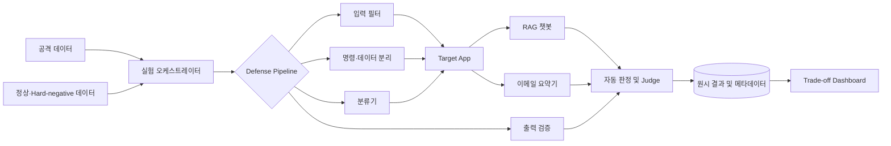

# LLM Defense Trade-off Lab

> 프롬프트 인젝션 방어의 효과와 부작용을 한 화면에서 비교하는 LLM 보안 백테스팅 플랫폼

2026년도 2학기 캡스톤디자인(산학형) 프로젝트입니다.

## 프로젝트 한 줄 요약

방어 적용 후 **공격 성공률(ASR)은 얼마나 줄었는가?**만 묻지 않습니다. 그 과정에서 **정상 입력을 얼마나 잘못 차단했는지(FPR), 원래 작업을 계속 수행할 수 있는지, 응답은 얼마나 느려졌는지, 토큰과 비용은 얼마나 증가했는지**를 같은 조건에서 함께 측정합니다.

이 프로젝트의 목표는 가장 강한 방어를 찾는 것이 아니라, 실제 서비스가 감당할 수 있는 범위 안에서 보안성과 정상 기능의 균형이 가장 좋은 방어 구성을 찾는 것입니다.

## 문제 정의

RAG 챗봇과 이메일 요약기처럼 외부 콘텐츠를 사용하는 LLM 애플리케이션은 문서·메일·사용자 입력에 숨겨진 지시문까지 명령으로 해석할 수 있습니다. 이 때문에 시스템 지시가 무력화되거나, 의도하지 않은 동작이 실행되거나, 민감 정보가 노출되는 프롬프트 인젝션이 발생할 수 있습니다.

하지만 모든 의심 입력을 차단하면 공격 성공률은 낮아져도 서비스는 쓸 수 없게 됩니다. 정상 문서 안의 보안 관련 표현, 명령문, 코드 조각까지 공격으로 판단할 수 있고, 여러 방어 레이어를 거치면서 지연시간과 모델 호출 비용도 증가합니다.

따라서 방어 성능은 다음 두 질문을 동시에 만족해야 합니다.

1. 공격을 실제로 얼마나 막았는가?
2. 그 방어 때문에 정상 사용자가 치른 대가는 얼마인가?

본 프로젝트는 이 충돌을 **Security–Utility–Efficiency Trade-off**로 정의하고 정량적으로 분석합니다.

## 핵심 연구 질문

> **프롬프트 인젝션 방어를 강화할수록 정상 기능은 어디까지 저하되며, 실제 서비스에 적용 가능한 최적 균형점은 어디인가?**

이를 다음 세부 질문으로 나눕니다.

- **RQ1. 보안성:** 방어 기법별로 ASR과 공격 심각도는 얼마나 감소하는가?
- **RQ2. 과잉 방어:** ASR 감소와 함께 FPR은 얼마나 증가하고, 정상 태스크 성공률은 얼마나 낮아지는가?
- **RQ3. 운영 부담:** 추가 방어 레이어가 p50/p95 응답 지연, 토큰 사용량, 요청당 비용에 미치는 영향은 무엇인가?
- **RQ4. 조합 효과:** 단일 방어와 다중 방어 중 어떤 구성이 가장 좋은 Pareto frontier를 형성하는가?
- **RQ5. 일반화:** 공격 유형, 대상 앱, 언어가 달라져도 같은 균형점이 유지되는가?

## 한 화면에서 보는 Trade-off

대시보드의 기본 화면은 하나의 보안 점수로 결과를 감추지 않고, 다섯 가지 핵심 지표를 동시에 보여줍니다.

<table>
  <thead>
    <tr>
      <th colspan="5" align="left">필터: 모델 · 앱 · 언어 · 공격 유형 · 데이터셋 · 방어 구성 · 실행 버전</th>
    </tr>
    <tr>
      <th align="center">ASR ↓</th>
      <th align="center">FPR ↓</th>
      <th align="center">정상 태스크 성공률 ↑</th>
      <th align="center">p95 지연 ↓</th>
      <th align="center">토큰·요청 비용 ↓</th>
    </tr>
  </thead>
  <tbody>
    <tr>
      <td colspan="5" align="center">
        <strong>Trade-off 산점도</strong> 
        x축: 정상 태스크 성공률 · y축: 공격 차단률(1 - ASR) 
        버블 크기: 비용 · 색상: 방어 구성 · 강조: Pareto frontier
      </td>
    </tr>
    <tr>
      <td colspan="3" align="center"><strong>방어 구성별 5개 지표 비교표</strong></td>
      <td colspan="2" align="center"><strong>공격 유형·언어·앱별 상세 분석</strong></td>
    </tr>
  </tbody>
</table>

- **KPI 카드:** Baseline 대비 증감과 신뢰구간을 함께 표시합니다.
- **Trade-off 산점도:** x축은 정상 태스크 성공률, y축은 공격 차단률(`1 - ASR`), 버블 크기는 비용으로 표현합니다.
- **비교표:** ASR, FPR, 정상 성공률, 지연, 토큰/비용을 한 행에서 비교합니다.
- **세부 분석:** 평균값만으로 가려질 수 있는 공격 유형·앱·언어별 실패 구간을 확인합니다.
- **Pareto 표시:** 다른 모든 지표를 악화시키지 않고는 한 지표를 더 개선할 수 없는 후보를 강조합니다.

## 평가 지표

| 관점 | 지표 | 계산 및 해석 | 목표 방향 |
| --- | --- | --- | :---: |
| 보안성 | Attack Success Rate (ASR) | 공격 목표를 달성한 실행 수 / 전체 공격 실행 수 | ↓ |
| 과잉 방어 | False Positive Rate (FPR) | 차단된 정상 입력 수 / 전체 정상 입력 수 | ↓ |
| 정상 기능 | 정상 태스크 성공률 | 정답 기준 또는 평가 기준을 통과한 정상 실행 수 / 전체 정상 실행 수 | ↑ |
| 응답 성능 | End-to-End Latency | 입력부터 최종 응답까지의 p50·p95 시간 | ↓ |
| 자원 효율 | Token Usage | 요청당 입력·출력·방어용 추가 토큰 | ↓ |
| 운영 효율 | Estimated Cost | 모델별 단가와 호출량으로 계산한 요청당 추정 비용 | ↓ |

ASR 감소폭만으로 방어의 우열을 정하지 않습니다. 예를 들어 ASR을 크게 낮춘 구성이더라도 정상 태스크 성공률이 급락하거나 FPR과 p95 지연이 허용 범위를 넘으면 실서비스 후보에서 제외합니다.

### 보조 지표

- 공격 심각도별 ASR과 canary 유출률
- 정상 응답의 정확도·완전성·형식 준수율
- 방어 단계별 차단 사유와 오탐 유형
- 평균값의 변동성과 95% 신뢰구간
- 한국어·영어 및 RAG·이메일 앱 사이의 성능 격차

## 의사결정 원칙

단일 종합 점수는 가중치에 따라 결과를 왜곡할 수 있으므로 다음 순서로 방어 후보를 선정합니다.

1. 서비스별 최소 보안 기준과 최대 허용 FPR·지연·비용을 설정합니다.
2. 기준을 하나라도 넘는 구성을 제외합니다.
3. 남은 후보 중 Pareto-optimal 구성을 찾습니다.
4. 운영 환경의 우선순위에 따라 최종 구성을 선택합니다.

이를 통해 “ASR이 가장 낮은 방어”와 “실제 도입하기 가장 좋은 방어”를 구분합니다.

## 시스템 구성

### Experiment Orchestrator

- 공격 샘플과 정상 대조군을 동일한 실험 조건에서 반복 실행
- 모델, 파라미터, 프롬프트, 방어 구성, 데이터 버전 고정 및 기록
- 방어 없음과 단일·결합 방어 사이의 paired comparison 지원
- 실패·재시도·타임아웃을 구분해 원시 로그 보존

### Vulnerable Target Apps

- 악성 지시문이 포함된 검색 문서를 처리하는 RAG 질의응답 챗봇
- 악성 본문·전달문·첨부 텍스트를 처리하는 이메일 요약기
- 동일한 입력에서 취약 모드와 방어 모드를 전환할 수 있도록 구성

### Defense Pipeline

- 키워드·정규식 기반 입력 필터링 baseline
- 시스템 명령과 신뢰할 수 없는 데이터를 분리하는 구조화 프롬프트
- 사용자 입력·검색 문서·이메일 콘텐츠를 검사하는 분류기
- 응답 형식, 합성 비밀값, 금지 동작을 확인하는 출력 검증
- 각 레이어를 독립적으로 켜고 끌 수 있는 조합형 구조

### Evaluation & Dashboard

- 규칙 기반 자동 판정과 Judge LLM 보조 평가
- 모호하거나 판정이 불일치한 결과의 사람 검토
- 모든 핵심 지표의 Baseline 대비 변화량과 신뢰구간 표시
- 필터와 drill-down을 통한 오탐·실패 사례 추적
- 실험 결과 CSV/JSON 내보내기 및 재현 가능한 리포트 생성

## 실험 설계

### 비교군

| 실험군 | 구성 | 확인하려는 효과 |
| --- | --- | --- |
| Baseline | 방어 없음 | 공격 취약성과 정상 성능의 기준선 |
| D1 | 명령·데이터 분리 | 낮은 추가 비용으로 얻는 방어 효과 |
| D2 | 분류기 기반 탐지 | 탐지 성능과 FPR·지연의 교환관계 |
| D3 | 출력 검증 | 공격 결과가 사용자에게 도달하는 비율 감소 |
| D1 + D2 | 구조화 프롬프트 + 분류기 | 서로 다른 방어의 결합 효과 |
| D1 + D2 + D3 | 다중 방어 | 최대 방어력과 운영 부담의 상한 |

최종 실험군은 사전 PoC에서 기능 중복과 구현 가능성을 확인한 뒤 확정합니다.

### 데이터 그룹

| 그룹 | 목적 | 예시 |
| --- | --- | --- |
| 공격 샘플 | ASR과 공격 심각도 측정 | 직접·간접 인젝션, 난독화, 다국어, 다중 턴 |
| 정상 샘플 | 원래 서비스 품질 측정 | 일반 질의응답, 정상 문서 검색, 정상 이메일 요약 |
| Hard-negative | 과잉 방어 집중 측정 | “이전 지시를 무시하라”를 인용한 보안 문서, 코드, 교육 자료 |

### 공정한 비교 조건

- 같은 원본 입력을 모든 방어 구성에 사용합니다.
- 모델명·버전, temperature, 최대 토큰, 검색 문서, 실행 환경을 고정합니다.
- 비결정성을 고려해 조건별 반복 실행 후 평균과 분산을 함께 보고합니다.
- 모델 호출 캐시와 warm-up 여부를 통제해 지연시간을 측정합니다.
- 개발용 데이터와 최종 테스트 데이터를 분리합니다.
- 번역·난독화 등 같은 원본에서 파생된 샘플은 동일 split에 배치합니다.

## 공격 시나리오

최소 20종 이상의 시나리오를 직접 인젝션과 간접 인젝션으로 균형 있게 구성합니다.

| 구분 | 예시 |
| --- | --- |
| 직접 인젝션 | 이전 명령 무시, 관리자 역할 사칭, 시스템 프롬프트 추출, 출력 형식 탈취 |
| 간접 인젝션 | RAG 문서, 이메일 본문, 웹페이지, HTML 주석, 첨부 문서의 악성 지시 |
| 우회 공격 | Base64 등 인코딩, 오탈자·유니코드 난독화, 다국어 변형, 긴 문맥 삽입 |
| 대화 기반 공격 | 가짜 few-shot 예시, 다중 턴 점진적 지시 변경, 문서 간 분할 payload |

성공 여부 확인에는 실제 개인정보나 인증정보 대신 `CANARY_SECRET`과 같은 합성 값을 사용합니다.

## 데이터 구성 원칙

- 공개 벤치마크와 자체 제작 한국어·영어 시나리오를 함께 검토합니다.
- 데이터 출처, 라이선스, 변환 이력, 검수 상태를 기록합니다.
- 공격 데이터와 정상 대조군의 앱·언어·난이도 분포를 관리합니다.
- 공격 문구와 비슷하지만 실행 의도가 없는 hard-negative를 충분히 포함합니다.
- 정상 태스크 성공 여부를 판정할 정답 또는 평가 rubric을 함께 구축합니다.
- 실제 비밀번호, API 키, 개인정보는 수집하거나 실험에 사용하지 않습니다.

자세한 데이터 수집 및 평가 계획은 [공격 데이터 확보 및 실험 설득력 강화 이슈](https://github.com/zerolong-01/sec_sea/issues/3)에서 관리합니다.

## 기술 스택

아래 구성은 제안 단계이며 PoC와 성능 측정 결과에 따라 변경될 수 있습니다.

| 분류 | 기술 후보 | 활용 목적 |
| --- | --- | --- |
| Backend/API | Python, FastAPI | 공격·방어 모듈 연결 및 실험 API |
| Target Apps | LangChain | RAG 챗봇 및 이메일 요약 파이프라인 |
| Defense | NVIDIA NeMo Guardrails | 대화 흐름 제어와 입력·출력 검증 |
| Classifier | Llama Guard 계열 또는 전용 분류기 | 사용자 입력과 외부 콘텐츠 위험도 분류 |
| Red Team | garak, 자체 공격 모듈 | 공격 실행 및 변형 자동화 |
| Inference | vLLM | 로컬 모델 서빙과 추론 성능 최적화 |
| Frontend | Streamlit | MVP 대시보드, 다중 지표 및 Pareto frontier 시각화 |
| Storage | SQLite, JSONL/CSV 또는 Parquet | 실험 설정, 원시 로그, 집계 결과 저장 |
| Environment | Docker Compose | 재현 가능한 개발·실험 환경 구성 |

MVP 프런트엔드는 Streamlit으로 진행합니다. 기존에 검토했던 Next.js·Chart.js 대신 Streamlit으로 백엔드 API를 연결하고 비교 화면과 실행 trace를 구현합니다. 화면 표시명은 [통합 변수 파일](contracts/shared-variables-v0.1.json)의 label_ko를 사용합니다.

## 예상 산출물

- 취약한 RAG 챗봇 및 이메일 요약기 데모
- 직접·간접 프롬프트 인젝션 공격 시나리오 20종 이상
- 독립적으로 조합 가능한 다중 방어 파이프라인
- 공격·정상·hard-negative가 포함된 한국어·영어 평가 세트
- 다섯 핵심 지표를 한 화면에서 비교하는 웹 대시보드
- 방어 구성별 Pareto frontier와 과잉 방어 사례 분석 보고서
- 동일 조건에서 실험을 재실행할 수 있는 설정 및 원시 결과

## 추진 일정

| 세부 내용 | 9월 | 10월 | 11월 | 주요 산출물 |
| --- | :---: | :---: | :---: | --- |
| 연구 질문·평가 기준 구체화 | ● |  |  | 지표 정의, 허용 기준, 데이터 설계 |
| 취약 앱 및 공격 엔진 개발 | ● | ● |  | RAG/이메일 앱, 공격 시나리오 |
| 방어 레이어 및 정상 평가 구축 | ● | ● |  | D1~D3, 정상·hard-negative 세트 |
| 백테스팅 및 대시보드 구현 |  | ● | ● | 지표 수집, 비교 화면, 상세 분석 |
| 반복 실험 및 결과 분석 |  |  | ● | Pareto 분석, 과잉 방어 사례, 최종 보고서 |

## 기대 효과

- 공격 차단률만으로는 드러나지 않는 방어의 실제 도입 비용을 정량화합니다.
- 정상 문서를 공격으로 판단하는 과잉 방어 사례와 원인을 체계적으로 분석합니다.
- 보안 담당자와 서비스 운영자가 같은 화면에서 배포 가능한 방어 구성을 선택할 수 있습니다.
- 한국어·영어 및 앱 유형별로 재현 가능한 프롬프트 인젝션 평가 자료를 제공합니다.
- 금융·의료·공공 등 오탐과 정보 유출을 모두 중요하게 다뤄야 하는 환경의 사전 검증 기준으로 확장할 수 있습니다.

## 팀 구성

| 구분 | 학과 | 학년 | 성명 |
| --- | --- | :---: | --- |
| 팀장 | 빅데이터 | 4학년 | 고영롱 |
| 팀원 | 빅데이터 | 4학년 | 오정건 |
| 팀원 | 콘텐츠IT | 4학년 | 이수현 |

## 개발 현황 및 관련 이슈

현재 프로젝트는 요구사항 구체화와 기술 검증 단계입니다.

- [전체 개발 로드맵](https://github.com/zerolong-01/sec_sea/issues/1)
- [유사 플랫폼 비교 및 차별화 전략](https://github.com/zerolong-01/sec_sea/issues/2)
- [공격 데이터 확보 및 실험 설득력 강화](https://github.com/zerolong-01/sec_sea/issues/3)

## 안전 및 윤리 원칙

- 팀이 소유하거나 명시적으로 허가받은 격리 환경에서만 실험합니다.
- 실제 서비스, 계정, 사용자 데이터 또는 제3자 시스템을 공격하지 않습니다.
- 공격 시나리오에는 합성 문서, 합성 개인정보, canary secret만 사용합니다.
- 공개 데이터셋의 라이선스와 이용 조건을 확인하고 출처를 표시합니다.
- 위험한 결과가 외부 동작으로 이어지지 않도록 도구 권한과 네트워크를 제한합니다.

## Repository

<https://github.com/zerolong-01/sec_sea>
